# Planify - Android App 📅 ✅

Bienvenido a **Planify**, una aplicación moderna y elegante para la organización personal y multi-usuario. Gestiona tus tareas, colabora en listas compartidas, organiza calendarios y añade eventos usando Inteligencia Artificial y reconocimiento de voz nativo.

## ✨ Características Principales

*   **Autenticación**: Registro e inicio de sesión seguros.
*   **Gestión de Tareas (Tasks)**: Crea listas de tareas, organízalas por orden alfabético o actividad, y marca tareas como completadas.
*   **Calendarios Compartidos**: Crea múltiples calendarios, asígnales colores e invita a otros usuarios a colaborar.
*   **Creación de Eventos con IA**: Describe tu evento mediante texto o voz y deja que la Inteligencia Artificial rellene los datos y fechas por ti.
*   **Personalización y Diseño**: Interfaz moderna usando _Glassmorphism_, selector de colores en arcoíris y tipografías cuidadas.
*   **Widgets de Escritorio**: Consulta tus próximos eventos en el widget de 7 días, o marca tareas directamente desde la pantalla de inicio de tu dispositivo.
*   **Multi-usuario**: Invita a amigos o compañeros de trabajo a listas de tareas y calendarios usando su email.

---

## 📸 Capturas de Pantalla

### Bienvenida y Autenticación

  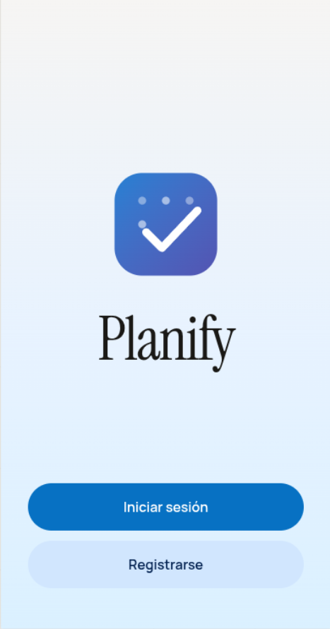
  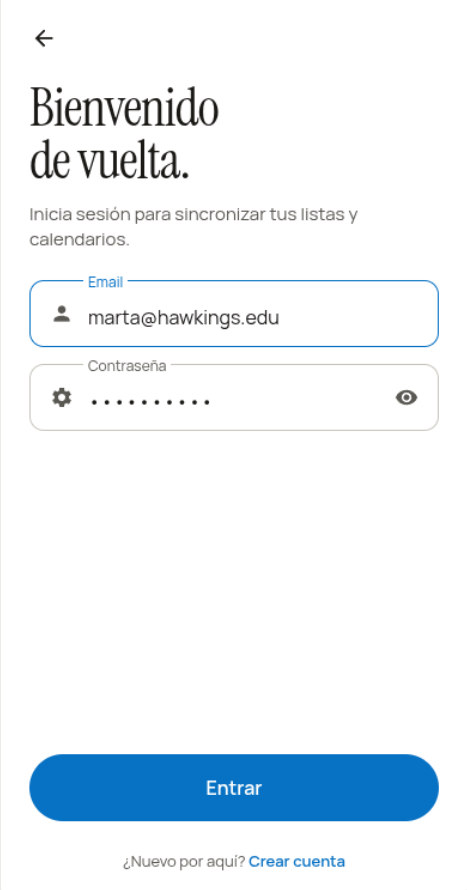
  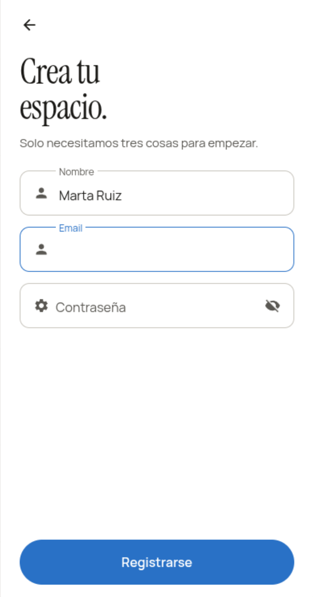
  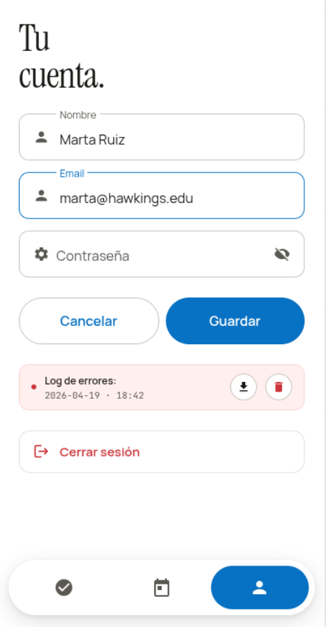

### Gestión de Tareas

  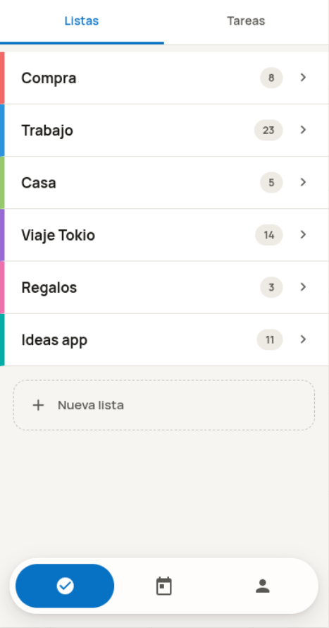
  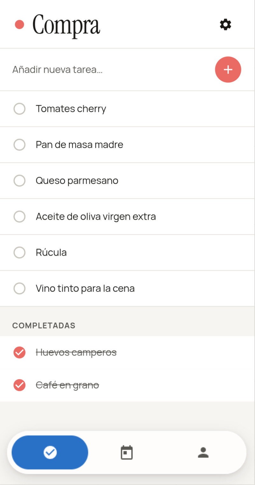
  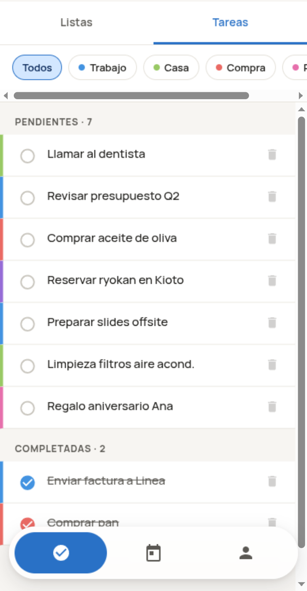
  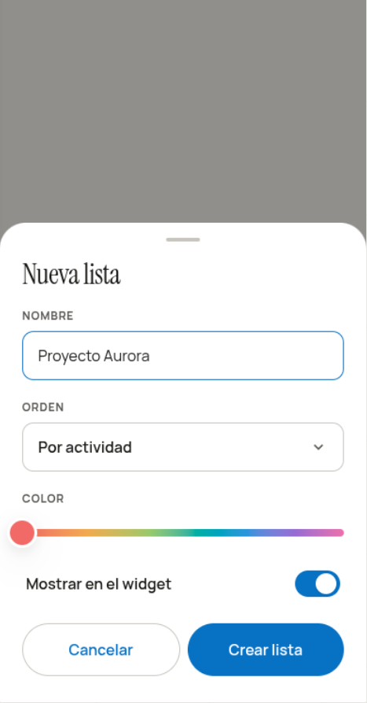

### Calendarios y Eventos

  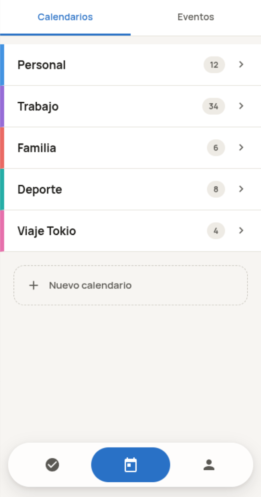
  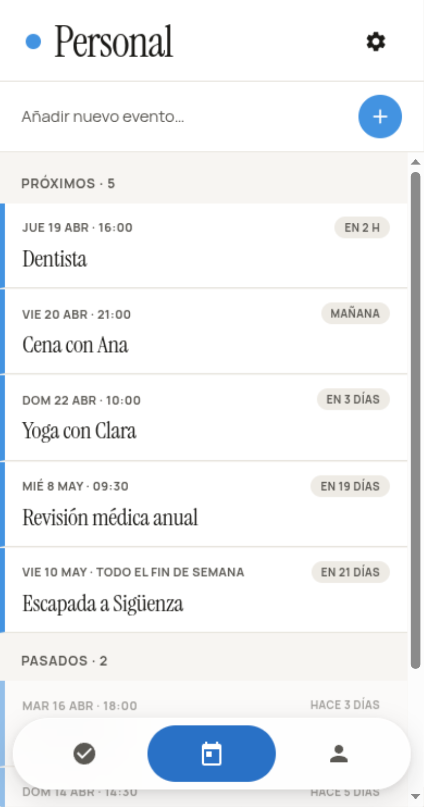
  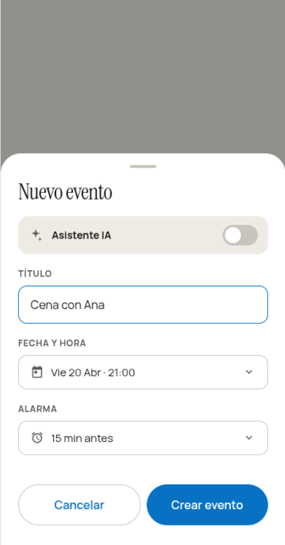
  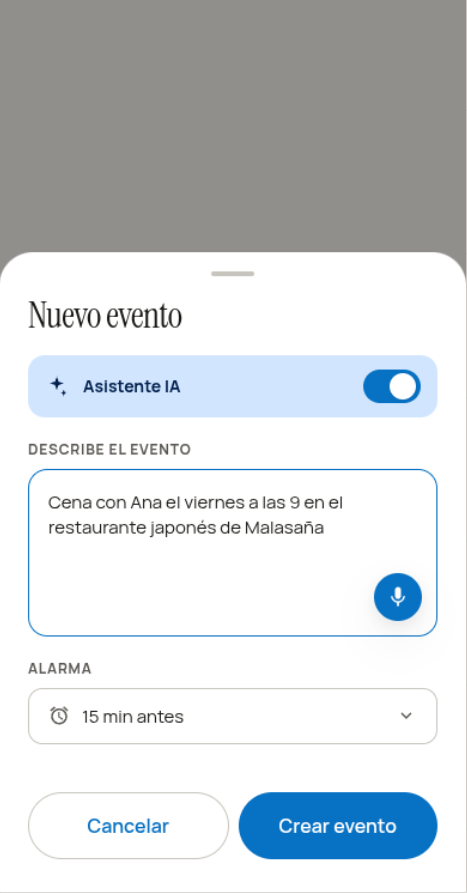

### Colaboración y Widgets

  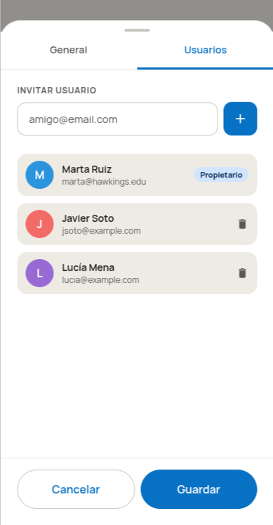
  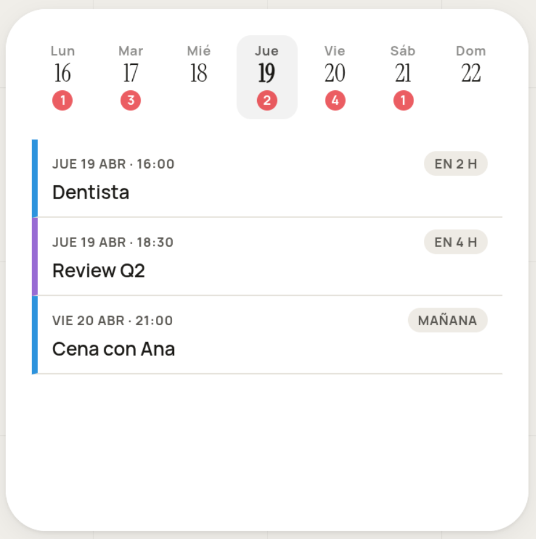
  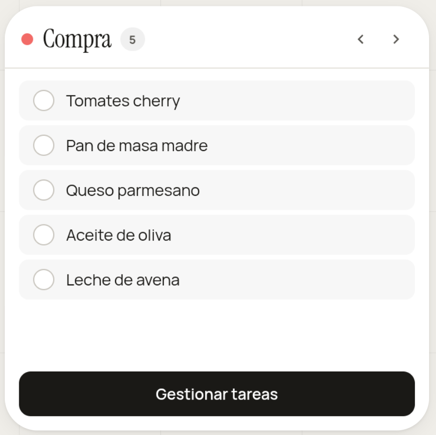

---

## 🚀 Requisitos Previos

*   [Android Studio](https://developer.android.com/studio) (Koala o superior recomendado).
*   **JDK 17** o superior.
*   Un emulador Android o dispositivo físico ejecutando Android 8.0 (API 26) o superior.
*   Para que la aplicación funcione, es indispensable tener el **Backend** configurado y en ejecución.

## 🛠️ Instalación y Ejecución

El proyecto está dividido en dos partes: el Backend (PHP) y la App de Android (Kotlin).

### 1. Despliegue del Backend
El backend está construido con PHP 8.5 y SQLite. Consulta el repositorio oficial en [Planify-Backend (GitHub)](https://github.com/eusonlito/Planify-Backend) para obtener las instrucciones detalladas de instalación, configuración y ejecución de la base de datos.

### 2. Ejecutar la Aplicación Android

1. **Abrir en Android Studio:**
   Abre el directorio `app/` directamente con Android Studio. Gradle comenzará a descargar las dependencias automáticamente.

2. **Configuración de la URL del Servidor:**
   Asegúrate de que la aplicación esté apuntando a la URL correcta del backend local (generalmente definida en el archivo `local.properties` o en las constantes del proyecto).

3. **Lanzar la App (Android Studio):**
   Selecciona tu dispositivo/emulador en Android Studio y presiona el botón **Run** (▶️) o usa el atajo `Shift + F10`.

---

## 🏗️ Arquitectura y Documentación

Planify ha sido desarrollada nativamente para Android priorizando una arquitectura escalable:

*   **Navegación:** _Bottom Navigation_ global con _Tabs_ superiores para separar módulos de Tareas y Calendarios.
*   **Estilo UI:** Fuerte énfasis en _Glassmorphism_ (desenfoque) y _Material Design_ adaptado para crear un estilo visual consistente y "limpio".
*   Para entender en detalle la arquitectura visual y el enrutamiento interno de las pantallas, revisa el archivo de **[Documentación de Pantallas (SCREEN.md)](docs/SCREEN.md)**.
*   Para información del consumo de APIs, consulta la [Documentación de la API del Backend](https://github.com/eusonlito/Planify-Backend/blob/main/docs/API.md).

---

## 🤝 Contribuir
Al contribuir al desarrollo de la aplicación, por favor asegúrate de respetar las convenciones de nomenclatura, mantener un código limpio e hidratar el diseño base definido en las capturas de pantalla de la carpeta `design/`.
